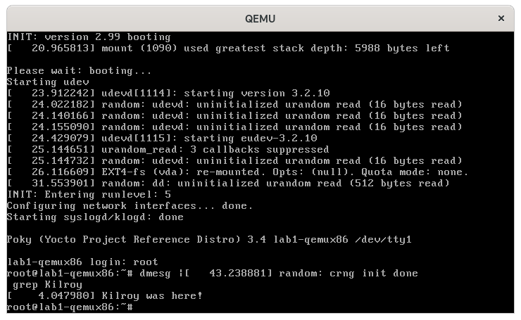

.. SPDX-License-Identifier: CC-BY-SA-2.0-UK

********************************
Lab 1: Traditional Kernel Recipe
********************************

In this lab you will modify a stock 5.14 Linux kernel recipe to make
it boot on a qemux86 machine. You will then apply a patch and modify
the configuration to add a simple kernel module which prints a message
to the console. This will familiarize you with the basic bitbake
workflow for working with and modifying simple kernel recipes. We will
use the editor :command:`vi` to modify files in this lab material, but
you should be able to use any text editor you prefer.

Set up the Environment
======================

.. code-block:: shell

   $ cd ~/poky/
   $ source oe-init-build-env

Open :file:`local.conf`:

.. code-block:: shell

   $ vi conf/local.conf

Add the following line just above the line that says
``MACHINE ??= “qemux86”``:

.. code-block:: shell

   MACHINE ?= "lab1-qemux86"

Save your changes and close :command:`vi` (:kbd:`:wq`).

Now open :file:`bblayers.conf`:

.. code-block:: shell

   $ vi conf/bblayers.conf

and add the 'meta-lab1-qemux86' layer to the :term:`BBLAYERS` variable.
The final result should look like this, assuming your account is called
'myacct' (simply copy the line containing 'meta-yocto-bsp' and
replace 'meta-yocto-bsp' with 'meta-lab1-qemux86'):

.. code-block:: shell

   BBLAYERS ?= " \
     /home/myacct/poky/meta \
     /home/myacct/poky/meta-poky \
     /home/myacct/poky/meta-yocto-bsp \
     /home/myacct/poky/meta-lab1-qemux86 \
     "

You should not need to make any further changes. Save your changes
and close :command:`vi`.

The meta-lab1-qemux86 layer provides a very simple Linux 5.14 recipe.
Open it in :command:`vi` for review:

.. code-block:: shell

   $ vi ~/poky/meta-lab1-qemux86/recipes-kernel/linux/linux-korg_5.14.bb

This is a bare-bones simple Linux kernel recipe. It inherits all of
the logic for configuring and building the kernel from
::ref:`kernel.bbclass <ref-classes-kernel>` (the ``inherit kernel``
line) which can be found in the :file:`meta/classes/` directory. It
specifies the Linux kernel sources in the :term:`SRC_URI` variable. It
is mostly empty for now, so the Linux kernel configuration system will
use defaults for most options. By default, the build system will look
for the package source in a directory having the same name as the
recipe's package name, or :term:`PN` (recipe names are generally of
the form ``PN_PV``, where :term:`PN` refers to 'Package Name' and
:term:`PV` refers to 'Package Version'). In the case of the
:file:`linux-korg_5.14.bb` recipe, the package name and thus the
source directory would be :file:`linux-korg/`. Because the kernel
tarball extracts into a different directory, :file:`linux/`, we need
to make the build system aware of this non-default name, which is the
purpose of the ``S = ${WORKDIR}/linux-${PV}`` line in the recipe. You
will also notice a commented out patch on another :term:`SRC_URI` line
-- leave it commented out for now, we will come back to that later.

The ``meta-lab1-qemux86`` layer also provides a fairly standard machine
configuration whose purpose is to define a group of machine-specific
settings for the 'lab1-qemux86' machine.  These settings provide
machine-specific values for a number of variables (all documented in
the :doc:`/ref-manual/index`) which allow us to boot the
``lab1-qemux86`` machine into a graphical qemu environment.  Open it in
:command:`vi` for review:

.. code-block:: shell

   $ vi ~/poky/meta-lab1-qemux86/conf/machine/lab1-qemux86.conf

Without going into too much detail, there are a few things to note
about this file. The first is the file name itself; note that the
base filename matches the machine name, in this case ``'lab1-qemux86'``,
which is also the same as the machine name specified in the
:term:`MACHINE` setting in :file:`local.conf`.

Secondly, note that other than the ``require`` statements, which
essentially just implement a file inclusion mechanism, the
configuration consists almost entirely of variable assignments. The
various assignment operators are documented elsewhere and are
relatively obvious, but for now we'll just mention that the ``?=``
assignment operator implements conditional assignment: if the variable
hasn't already been set, it takes on the value specified on the
right-hand-side.

Finally, a word of explanation about the :term:`PREFERRED_PROVIDER`
assignments in the machine configuration file. Many components of
the build system have multiple implementations available. The build
system will normally choose a default implementation and version for
a particular component, but sometimes it makes sense for a machine
to explicitly specify another implementation and/or version if it
knows it doesn't want to use the defaults. It may also want to specify
some values in order to 'pin down' a particular implementation and
version regardless of what the defaults are, or how they may change
in the future.

In the case of the ``'lab1-qemux86'`` machine, you see that it
specifies a :term:`PREFERRED_PROVIDER` for the ``virtual/kernel``
component:

.. code-block:: shell

   PREFERRED_PROVIDER_virtual/kernel ?= "linux-korg"

The reason it does this is that if it didn't, it would pick up the
default ``linux-yocto-5.14`` kernel (which is the version specified in
the ``qemu.inc`` file included following that line). Also, because
there's only a single ``linux-korg_*`` recipe, there's no ambiguity
about which version to choose and therefore no specific version
specified. If you needed to, you could do that using a
:term:`PREFERRED_VERSION` directive -- you'll see an example of that in
Lab 2.

.. note::
   The reason the layers and the machines have slightly unwieldy names
   e.g. 'lab1-qemux86' rather than just the simpler 'lab1' is that
   there's a known problem with the runqemu script in that it will
   only recognize machine names that end with one of the base qemu
   machine names (see Yocto Bug #2890 for details). Keep this in mind
   if you decide to create your own qemu-machine based BSP layers.
   Moreover, you can see that there is a line which specifies the
   ``QB_SYSTEM_NAME`` to qemu-system-i386 :

   ``QB_SYSTEM_NAME = “qemu-system-i386”``

This line is always important as it helps your machine to get
recognized as a valid machine by the QEMU Emulator. Missing this line
will result in a runtime error when you try to boot up your image
through :command:`runqemu` command later in the lab activities.

It is necessary to supply a value for :term:`LIC_FILES_CHKSUM` for the
kernel license file. Use :command:`md5sum` to get the checksum.

.. code-block:: shell

   $ md5sum ./tmp/work/lab1_qemux86-poky-linux/linux-korg/5.14-r0/license-destdir/linux-korg/COPYING

Then add the result to
:file:`meta-lab1-qemux86/recipes-kernel/linux/linux-korg_5.14.bb`:

.. code-block:: shell

   LIC_FILES_CHKSUM = "file://COPYING;md5=6bc538ed5bd9a7fc9398086aedcd7e46 "

Build the Image
===============

Now you will build the kernel and assemble it into a qemu bootable
image. This first build may take a long time, perhaps up to an hour,
so go have lunch! (the first build will take the longest, since in
addition to building, the system will download all the packages it
needs).

.. code-block:: shell

   $ bitbake core-image-minimal

.. note::
   For this lab, there will be a number of warning messages of the
   form 'WARNING: Failed to fetch ...'. You can safely ignore those.

Now boot the image with QEMU:

.. code-block:: shell

   $ runqemu tmp/deploy/images/lab1-qemux86/bzImage-lab1-qemux86.bin tmp/deploy/images/lab1-qemux86/core-image-minimal-lab1-qemux86.ext4

.. note::
   If you haven't already set up your TAP networking devices, such as
   with the ``runqemu-gen-tapdevs`` script, then :command:`runqemu`
   will possibly ask you for your 'sudo' password. You can also pass
   'slirp' as an option to :command:`runqemu` to use user-space
   networking.

A black QEMU window should appear and immediately start printing the
Linux kernel boot messages... followed by a kernel panic:

The kernel failed to load a root filesystem. Note that under the “List
of all partitions:” there are no devices. This means that the kernel
did not find a driver for any of the block devices provided for the
qemu machine. And we also need to add some virtual drivers to support
qemu.

Reconfigure the Linux Kernel
============================

QEMU provides an Intel PIIX IDE controller. Use the Linux kernel
menuconfig command to configure this into your kernel:

.. code-block:: shell

   $ bitbake virtual/kernel -c menuconfig

A new window will appear that allows you to enable various Linux
kernel configuration options. Use the following keys to navigate
the menu:

* :kbd:`Up`/:kbd:`Down` arrows: move up and down
* :kbd:`Left`/:kbd:`Right` arrows: Choose a command
  :guilabel:`<Select>` :guilabel:`<Exit>` or :guilabel:`<Help>`
* :kbd:`Enter`: Execute a command

  * :guilabel:`<Select>` Descends into a menu
  * :guilabel:`<Exit>` Backs out of a menu, or exits
    :command:`menuconfig`

* :kbd:`Space`: toggle a configuration option

Note that before descending into a menu that is itself configurable,
you will need to check the menu item or its contents will be empty.

Enable the following options:

.. code-block:: shell

   Device Drivers --->
     <*> Serial ATA and Parallel ATA drivers (libata)  --->
       <*>       Intel ESB, ICH, PIIX3, PIIX4 PATA/SATA support
       <*>       Intel PATA old PIIX support
       <*>       Intel SCH PATA support
     [*] Virtualization drivers  --->
     [*] Virtio drivers --->
       <*>   PCI driver for virtio devices
       [*]     Support for legacy virtio draft 0.9.X and older devices
     [*] Block devices  --->
       <*>   Virtio block driver
     Generic Driver Options  --->
       [*] Maintain a devtmpfs filesystem to mount at /dev
       [*]   Automount devtmpfs at /dev, after the kernel mounted the rootfs
   File systems  --->
     <*> The Extended 4 (ext4) filesystem
     [*]   Use ext4 for ext2 file systems

.. ********************************************************
   Maintainers:
     Be careful to ensure the Kconfig options agree with
     the kernel version being used in the lesson.
   ********************************************************

Exit and save your changes by selecting :guilabel:`<Exit>` and pressing
:kbd:`Enter`, repeat until it prompts you to save your changes.

Now rebuild and deploy only the kernel. This avoids having to rebuild
the image itself, which has not changed, saving you a few minutes.
Then try to boot it in QEMU again:

.. code-block:: shell

   $ bitbake virtual/kernel -c compile -f
   $ bitbake virtual/kernel -c deploy
   $ runqemu tmp/deploy/images/lab1-qemux86/bzImage-lab1-qemux86.bin tmp/deploy/images/lab1-qemux86/core-image-minimal-lab1-qemux86.ext4

QEMU will start as before, but this time will boot all the way to a
login prompt. You might see a number of scary-looking errors and
warnings on the console. This is due to the fact that you're starting
with a bare-bones configuration and simply trying to get to a
functional boot prompt, without bothering to worry about anything more
at this point. In this respect, you have a successful outcome, and you
can should now be able to log in as root with no password if you want
to poke around.

Up to this point, if you were to share the ``meta-lab1-qemux86`` layer
with someone else, the kernel they build would still fail to boot,
because the fixes only exist in your system's :term:`WORKDIR`. You
need to update the :file:`defconfig` in the layer with the one you
modified with :command:`menuconfig`. Copy the :file:`.config` over the
:file:`defconfig` in the layer:

.. ********************************************************
   Maintainers:
     do not commit the 'corrected' defconfig, the lab needs
     to fail to boot out of the box.
   ********************************************************

.. code-block:: shell

   $ cp tmp/work/lab1_qemux86-poky-linux/linux-korg/5.14-r0/build/.config ~/poky/meta-lab1-qemux86/recipes-kernel/linux/linux-korg/defconfig

Patching the Kernel
===================

Now that you have the Linux kernel booting on your machine, you can
start modifying it. Here you will apply a patch to add a simple driver
which prints a message to the console during boot.

Open and review the patch so you know what to expect once it is
applied:

.. code-block:: shell

   $ vi ~/poky/meta-lab1-qemux86/recipes-kernel/linux/linux-korg/yocto-testmod.patch

Look for the ``printk`` statement in the ``yocto_testmod_init()``
function. This is the message you will look for to verify the changes
have taken effect.

Instruct the layer to apply the patch by adding it to the
:term:`SRC_URI`. Edit the Linux kernel recipe:

.. code-block:: shell

   $ vi ~/poky/meta-lab1-qemux86/recipes-kernel/linux/linux-korg_5.14.bb

Uncomment the following line (remove the leading ‘#’ character):

.. code-block:: shell

   #SRC_URI += "file://yocto-testmod.patch"

Save your changes and close :command:`vi`.

Now use menuconfig to enable the driver. Bitbake will detect that the
recipe file has changed and start by fetching the new sources and
apply the patch.

.. code-block:: shell

   $ bitbake virtual/kernel -c menuconfig

.. code-block:: shell

   Device Drivers  --->
     [*] Misc devices  --->
       [*] Yocto Test Driver (NEW)

Exit and save your changes as before.

.. ********************************************************
   Maintainers:
     do not commit the 'modified' defconfig, nor the recipe
     for linux-korg_*.bb, the lab needs to fail to boot out
     of the box, without the Yocto Test Driver.
   ********************************************************

Now rebuild the kernel and boot it in QEMU.

.. code-block:: shell

   $ bitbake virtual/kernel -c deploy
   $ runqemu tmp/deploy/images/lab1-qemux86/bzImage-lab1-qemux86.bin tmp/deploy/images/lab1-qemux86/core-image-minimal-lab1-qemux86.ext4

You can scroll back through the boot log using :kbd:`Shift+PgUp`. You
should find the Yocto test driver message in there or just grep for
it:

.. code-block:: shell

   $ dmesg | grep Kilroy
   [    4.047i980] Kilroy was here!

Finally, as before, if you want to save the configuration for
posterity, you need to update the :file:`defconfig` in the layer with
the one you modified for the new driver. To do so, you can copy the
:file:`.config` over the :file:`defconfig` in the layer (but it's not
required at this point, as the lab is essentially finished and the
results aren't required for any later labs):

.. code-block:: shell

   $ cp tmp/work/lab1_qemux86-poky-linux/linux-korg/5.14-r0/build/.config ~/poky/meta-lab1-qemux86/recipes-kernel/linux/linux-korg/defconfig

Lab 1 Conclusion
================

Congratulations! You have modified and configured the Linux kernel
using a traditional bitbake Linux kernel recipe. You also updated the
layer itself so that your changes can be shared. This concludes Lab 1.
