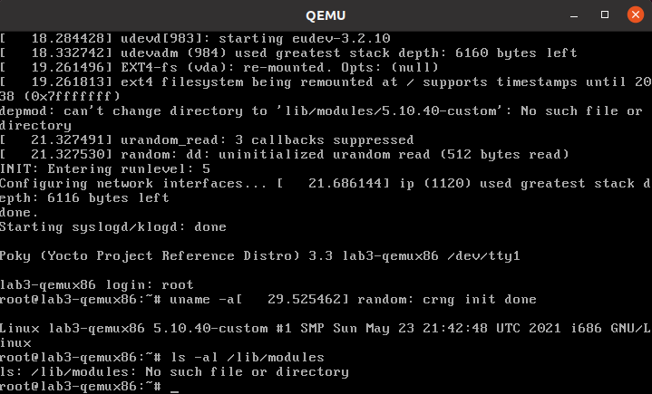
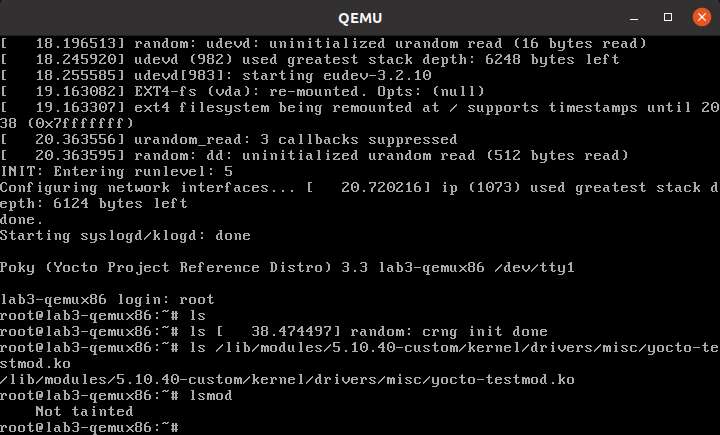
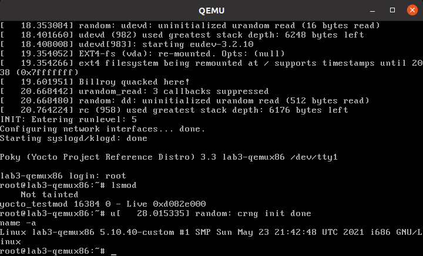

.. SPDX-License-Identifier: CC-BY-SA-2.0-UK

***************************
Lab 3: Custom Kernel Recipe
***************************

In this lab you will use use the ``linux-yocto-custom`` recipe and
tooling to make use of a non-linux-yocto git-based kernel of your
choosing, while still retaining the ability to reuse your work via
config fragments. You'll also learn what you need to do to build,
install, and automatically load a loadable kernel module instead of
as a built-in module as you did in Lab 2.

Set up the Environment
======================

.. code-block:: shell

   $ cd ~/poky/
   $ source oe-init-build-env

Open :file:`local.conf`:

.. code-block:: shell

   $ vi conf/local.conf

Add the following line just above the line that says
``MACHINE ??= “qemux86”``:

.. code-block:: shell

   MACHINE ?= "lab3-qemux86"

Save your changes and close :command:`vi`.

Now open :file:`bblayers.conf`:

.. code-block:: shell

   $ vi conf/bblayers.conf

and add the ``'meta-lab3-qemux86'`` layer to the :term:`BBLAYERS`
variable. The final result should look like this, assuming your account
is called 'myacct' (simply copy the line containing 'meta-yocto-bsp'
and replace 'poky/meta-yocto-bsp' with 'kernel-lab-layers/meta-lab3-qemux86'):

.. code-block:: shell

   BBLAYERS ?= " \
     /home/myacct/poky/meta \
     /home/myacct/poky/meta-poky \
     /home/myacct/poky/meta-yocto-bsp \
     /home/myacct/kernel-lab-layers/meta-lab3-qemux86 \
     "

You should not need to make any further changes. Save your changes and
close :command:`vi`.

Review the Lab 3 Layer
======================

This layer differs from meta-lab2-qemux86 only in the Linux kernel
recipe. This layer contains the following files for the kernel:

.. code-block:: shell

   recipes-kernel/
   └── linux
       ├── linux-yocto-custom
       │   ├── defconfig
       │   ├── lab3.cfg
       │   └── yocto-testmod.patch
       └── linux-yocto-custom_git.bb

Open the kernel recipe:

.. code-block:: shell

   $ vi ~/kernel-lab-layers/meta-lab3-qemux86/recipes-kernel/linux/linux-yocto-custom_git.bb

Note that this is a complete recipe rather an extension as in Lab 2. In
fact it was derived from the :file:`linux-yocto-custom.bb` recipe found
in :file:`poky/meta-skeleton/recipes-kernel/linux`. Notice that it
uses a :file:`defconfig` file and additionally adds :file:`lab3.cfg` to
the :term:`SRC_URI`. The :file:`defconfig` is required because this is
not a ``linux-yocto`` kernel as used in lab2, but rather an arbitrary
kernel wrapped by the ``linux-yocto-custom`` recipe.

An arbitrary kernel doesn't contain all the metadata present in the
``linux-yocto`` kernel and therefore doesn't have a mapping to any of
the base configuration items associated with the set of BSP types
available in the ``linux-yocto`` kernel. In the case of the
``linux-yocto`` kernel, this mapping is responsible for assembling the
:file:`.config` from a hierarchical collection of fragments, but since
a custom kernel doesn't have access to these, a :file:`defconfig` that
provides the basic set of options needed to boot the machine is
explicitly required.

However, because this is a ``linux-yocto-custom`` kernel, it does have
the ability to specify and reuse config fragments, which is the major
difference between this setup and the simple kernel used in Lab 1,
which also used a :file:`defconfig`.

The :file:`lab3.cfg` fragment is a Linux kernel config fragment. Rather
than a complete :file:`.config` file, a config fragment lists only the
config options you specifically want to change. To start out, this
fragment is commented out, and the ``linux-yocto-custom`` sources will
use only the :file:`defconfig` specified, which is compatible with
common PC hardware.

Build the Image
===============

OK, you have done this before:

.. code-block:: shell

   $ bitbake core-image-minimal
   $ runqemu nographic tmp/deploy/images/lab3-qemux86/bzImage-lab3-qemux86.bin tmp/deploy/images/lab3-qemux86/core-image-minimal-lab3-qemux86.ext4

Modify the Kernel
=================

Now you can apply the driver patch and configure the kernel to use it.

Edit the ``linux-yocto-custom`` kernel recipe:

.. code-block:: shell

   $ vi ~/kernel-lab-layers/meta-lab3-qemux86/recipes-kernel/linux/linux-yocto-custom_git.bb

and uncomment the lines including the patch and the lab3 config
fragment:

.. code-block:: shell

   SRC_URI += "file://yocto-testmod.patch"
   SRC_URI += "file://lab3.cfg"

Save your changes and close :command:`vi`.

Configure the Kernel
====================

You could use :command:`menuconfig` to enable the option, but since you
already know what it is, you can simply add it to the :file:`lab3.cfg`
file.

Open the file:

.. code-block:: shell

   $ vi ~/kernel-lab-layers/meta-lab3-qemux86/recipes-kernel/linux/linux-yocto-custom/lab3.cfg

and examine the following lines, which enable the module as a built-in
kernel module:

.. code-block:: shell

   # Enable the testmod
   CONFIG_YOCTO_TESTMOD=m

This configures the ``yocto-testmod`` as a module this time instead of
as a built-in module as in lab2. In order to actually get the module
into the image and loaded, you'll need to add a couple additional
items to the kernel recipe and machine configuration, but we'll cover
that in the following step.

Save your changes and close :command:`vi`.

.. tip::
   You know what you need to add now, but if you are not sure exactly
   which config option you need, you can save off the original
   :file:`.config` (after an initial ``linux-yocto`` build), then run
   :command:`menuconfig` and take a diff of the two files. You can
   then easily deduce what your config fragment should contain.

Rebuild the Image
=================

Now you can rebuild and boot the new image. You're rebuilding the new
image rather than just the kernel in this case because the module is
no longer included in the kernel image but rather in the
:file:`/lib/modules` directory of the filesystem image, which requires
us to build a new root filesystem. Bitbake will detect the recipe file
has changed and start by fetching the new sources and apply the patch:

.. code-block:: shell

   $ bitbake core-image-minimal
   $ runqemu tmp/deploy/images/lab3-qemux86/bzImage-lab3-qemux86.bin tmp/deploy/images/lab3-qemux86/core-image-minimal-lab3-qemux86.ext4

This time, you won't look for a message, but rather see whether your
module was loaded.  To do that, you'll use :command:`lsmod` to get a
list of loaded modules. Not seeing what you expect (you'd expect to see
``yocto_testmod`` in the output of :command:`lsmod`, but won't), you
should then check whether your modules were installed in the root
filesystem (you should see a :file:`kernel/drivers/misc` directory in
:file:`/lib/modules/&KERNEL_LAB_MAINLINE_FULL_VERSION;-custom`, containing your
:file:`yocto-testmod.ko` kernel module binary):

Obviously, you're not seeing what you'd expect, so let's verify whether your module was in fact built. You can do that by looking in the deploy
directory on the build system:

.. code-block:: shell

   $ ls ~/poky/build/tmp/deploy/rpm/lab3_qemux86/ | grep yocto-testmod

You should in fact see an RPM file that was created for the
``hello-testmod`` module – you should see something similar to the
following output from the previous command:

.. code-block:: shell

   kernel-module-yocto-testmod-&KERNEL_LAB_MAINLINE_FULL_VERSION;-custom-&KERNEL_LAB_MAINLINE_FULL_VERSION;+git0+4068786a86-r1.lab3_qemux86.rpm

So, your module was built, it just wasn't added to the image. One way
of making that happen is to add it to the machine configuration.

Add the Module to the Image and Have it Autoload on Boot
========================================================

Open the machine configuration file:

.. code-block:: shell

   $ vi ~/kernel-lab-layers/meta-lab3-qemux86/conf/machine/lab3-qemux86.conf

and uncomment the following line at the end of the file:

.. code-block:: shell

   MACHINE_ESSENTIAL_EXTRA_RRECOMMENDS += "kernel-module-yocto-testmod"

This will cause the yocto-testmod module to be included in the minimal
image, but it won't cause the module to be loaded on boot. Build the
minimal image again and boot it:

.. code-block:: shell

   $ bitbake core-image-minimal
   $ runqemu tmp/deploy/images/lab3-qemux86/bzImage-lab3-qemux86.bin tmp/deploy/images/lab3-qemux86/core-image-minimal-lab3-qemux86.ext4

Notice that the :file:`/lib/modules/&KERNEL_LAB_MAINLINE_FULL_VERSION;-custom` directory
containing the :file:`yocto-testmod` module is now present on the
booted system, but the module hasn't been loaded:

To have :file:`yocto-testmod` loaded on boot, you'll uncomment the
following line to the :file:`linux-yocto-custom` recipe:

.. code-block:: shell

   KERNEL_MODULE_AUTOLOAD += "yocto-testmod"

Open the :file:`linux-yocto-custom.bb` file and uncomment that line:

.. code-block:: shell

   $ vi ~/kernel-lab-layers/meta-lab3-qemux86/recipes-kernel/linux/linux-yocto-custom.bb

.. note::
   Your module isn't exactly 'essential' and you'd normally use
   :term:`MACHINE_EXTRA_RRECOMMENDS`, but this is the variable you
   need to use with the minimal image since it doesn't include the
   base package that includes the latter variable.

Now, let's build the minimal image again and boot it:

.. code-block:: shell

   $ bitbake core-image-minimal
   $ runqemu tmp/deploy/images/lab3-qemux86/bzImage-lab3-qemux86.bin tmp/deploy/images/lab3-qemux86/core-image-minimal-lab3-qemux86.ext4

This time, :command:`lsmod` shows :file:`yocto-testmod` loaded, as
expected:

Like before, QEMU will open a new window and boot to a login prompt.
You can use :kbd:`Shift+PgUp` to scroll up and find the new driver
message. You can also type :command:`dmesg | less` at the prompt to
look for the module init message.

Lab 3 Conclusion
================

In this lab you applied a patch and modified the configuration of an
arbitrary git-based non-linux-yocto Linux kernel using a config
fragment. You also added and autoloaded a module as a loadable
module. This concludes Lab 3.
