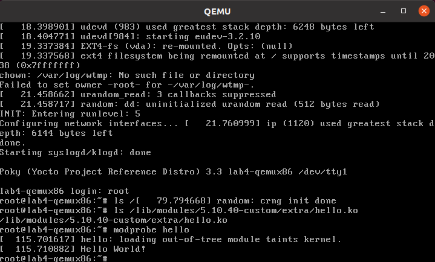
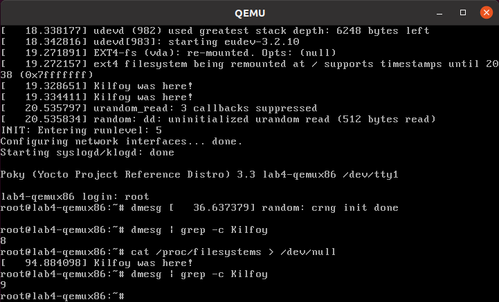

.. SPDX-License-Identifier: CC-BY-SA-2.0-UK

*************************************************
Lab 4: Custom Kernel Recipe With Local Repository
*************************************************

In this lab you will use the linux-yocto-custom recipe and tooling to
make use of a local non-linux-yocto git-based kernel of your choosing,
while still retaining the ability to reuse your work via config
fragments. This makes for an easier workflow when changing the kernel
code, which this lab will also demonstrate. This lab will also show
how to create and use a recipe to build and install an external kernel
module.

Set up the Environment
======================

.. code-block:: shell

   $ cd ~/poky/
   $ source oe-init-build-env

Open :file:`local.conf`:

.. code-block:: shell

   $ vi conf/local.conf

Add the following line just above the line that says
``MACHINE ??= “qemux86”``:

.. code-block:: shell

   MACHINE ?= "lab4-qemux86"

Save your changes and close :command:`vi`.

Now open :file:`bblayers.conf`:

.. code-block:: shell

   $ vi conf/bblayers.conf

and add the 'meta-lab4-qemux86' layer to the :term:`BBLAYERS` variable.
The final result should look like this, assuming your account is called
'myacct' (simply copy the line containing 'meta-yocto-bsp' and replace
'meta-yocto-bsp' with 'meta-lab4-qemux86'):

.. code-block:: shell

   BBLAYERS ?= " \
     /home/myacct/poky/meta \
     /home/myacct/poky/meta-poky \
     /home/myacct/poky/meta-yocto-bsp \
     /home/myacct/poky/meta-lab4-qemux86 \
     "

You should not need to make any further changes. Save your changes and
close :command:`vi`.

Review the Lab 4 Layer
======================

This layer differs from meta-lab3-qemux86 in that instead of
:file:`yocto-testmod` patch in the Linux kernel recipe itself, you'll
add an external kernel module called :file:`hello-mod`. It also
contains a change to the :term:`SRC_URI` in the
:file:`linux-yocto-custom.bb` that points it to a local kernel repo,
which you'll need to modify, and a :term:`KBRANCH` variable that will
point to a 'working branch' in the local repo, which we'll describe in
more detail later. This layer contains the following files for the
kernel:

.. code-block:: shell

   recipes-kernel /
     hello-mod /
       files /
         COPYING
         hello.c
         Makefile
     hello-mod_0.1.bb
     linux /
     linux-yocto-custom /
      defconfig
    linux-yocto-custom.bb

Open the kernel recipe:

.. code-block:: shell

   $ vi ~/poky/meta-lab4-qemux86/recipes-kernel/linux/linux-yocto-custom.bb

Note that as in lab3, this is a complete recipe rather an extension as
in lab2. In fact it was derived from the :file:`linux-yocto-custom.bb`
recipe found in :file:`honister/meta-skeleton/recipes-kernel/linux`.
Notice that it uses a :file:`defconfig` file but doesn't add any
additional :file:`.cfg` file to the :term:`SRC_URI` as in lab3.

Because you're adding an external module, you don't have a config
option in the kernel to define – the module will be included in the
image by virtue of the BSP configuration directives we'll describe in
a later step rather than via changes to the kernel configuration
itself.

The :file:`defconfig` is required because this is not a ``linux-yocto``
kernel as used in lab2, but rather an arbitrary kernel wrapped by the
:file:`linux-yocto-custom` recipe. An arbitrary kernel doesn't contain
all the metadata present in the ``linux-yocto`` kernel and therefore
doesn't have a mapping to any of the base configuration items
associated with the set of BSP types available in the ``linux-yocto``
kernel. In the case of the ``linux-yocto`` kernel, this mapping is
responsible for assembling the :file:`.config` from a collection of
fragments, but since a custom kernel doesn't have access to these, a
:file:`defconfig` that provides the basic set of options needed to
boot the machine is explicitly required.

However, because this is a ``linux-yocto-custom`` kernel, it does have
the ability to specify and reuse config fragments, which is the major
difference between this setup and the simple tarball-based kernel used
in lab1. To start out, the ``linux-yocto-custom`` sources will use the
:file:`defconfig` specified, which is compatible with common PC
hardware.

Moving on to the external module, open the :file:`hello-mod` recipe
and examine it:

.. code-block:: shell

   $ vi ~/poky/meta-lab4-qemux86/recipes-kernel/hello-mod/hello-mod_0.1.bb

The recipe itself is very simple – it names the files that make up the
module in the :term:`SRC_URI` and inherits the :file:`module` bbclass,
which enables the build system to build the code listed as a kernel
module. The :file:`hello-mod/files` directory contains the
:file:`hello.c` kernel source file and a module :file:`Makefile`, which
you can also examine.

Because in this lab you're building the kernel from a local repository,
you first need to create a local clone of the kernel you want to use.
To do this, :command:`cd` into the :file:`honister` directory and
create a local clone of the ``linux-stable`` kernel:

.. code-block:: shell

   $ cd ~/poky
   $ git clone git://git.kernel.org/pub/scm/linux/kernel/git/stable/linux-stable.git linux-stable-work.git

You should see something like the following as output:

.. code-block:: shell

   Cloning into 'linux-stable-work.git'...
   remote: Enumerating objects: 4150, done.
   remote: Counting objects: 100% (4150/4150), done.
   remote: Compressing objects: 100% (2048/2048), done.
   remote: Total 9511447(delta 2963), reused 2792 (delta 2102), pack-reused 9507297
   Receiving objects: 100% (9511447/9511447), 3.49 GiB | 1.89 MiB/s, done.
   Resolving deltas: 100% (7616872/7616872), done.
   Updating files: 100% (72212/72212), done.

.. note::
   Cloning the kernel can take a long time. You can speed up the clone
   if you already have a local clone that you can base the new one off
   of – see 'git-clone –reference' for details).

Now :command:`cd` into the cloned kernel and check out a branch named
'work-branch':

.. code-block:: shell

   $ cd ~/poky/linux-stable-work.git
   $ git checkout -b work-branch remotes/origin/linux-5.10.y

You should see something like the following as output:

.. code-block:: shell

   Checking out files: 100% (11240/11240), done.
   Branch work-branch set up to track remote branch linux-5.10.y from origin.
   Switched to a new branch 'work-branch'

Edit the :file:`linux-yocto-custom` kernel recipe:

.. code-block:: shell

   $ vi ~/poky/meta-lab4-qemux86/recipes-kernel/linux/linux-yocto-custom.bb

and change the :term:`SRC_URI` to point to the local clone you just
created. If you've done it as instructed, you should only need to
change :file:`home/myacct` to your home directory:

.. code-block:: shell

   SRC_URI = "git:///home/myacct/poky/linux-stable-work.git"

Note also the :term:`KBRANCH` line in the same file:

.. code-block:: shell

   KBRANCH = "work-branch"

The :term:`KBRANCH` variable names the branch that will be used to
build the kernel. If you've checked out and want to work with a
different branch, you should change the :term:`KBRANCH` variable to
that branch.

Save your changes and close :command:`vi`.

Build the Image
===============

OK, you have done this before (don't forget to cd back into the build
directory):

.. code-block:: shell

   $ cd ~/poky/build
   $ bitbake core-image-minimal
   $ runqemu tmp/deploy/images/lab4-qemux86/bzImage-lab4-qemux86.bin tmp/deploy/images/lab4-qemux86/core-image-minimal-lab4-qemux86.ext4

Add the External Kernel Module
==============================

Now that you have a working kernel, you can add the :file:`hello-mod`
external module to the image. Recall that you don't need to change the
kernel configuration to add the module because it won't be made part
of the kernel source via a :term:`SRC_URI` addition as in the previous
lab, but will be built as an 'external' module.

To do that, first open the machine configuration file:

.. code-block:: shell

   $ vi ~/poky/meta-lab4-qemux86/conf/machine/lab4-qemux86.conf

and uncomment the following line at the end of the file:

.. code-block:: shell

   MACHINE_ESSENTIAL_EXTRA_RRECOMMENDS += "hello-mod"

Note that in the :term:`MACHINE_ESSENTIAL_EXTRA_RRECOMMENDS` line, you
used the name of the :file:`hello-mod` package directly instead of
prepending it with 'kernel-module-' as you did in lab3. That's because
it has its own package created for it by virtue of the fact that it's
a standalone recipe, rather than the synthesized package created by
the kernel recipe in the case of lab3.

.. note::
   Your module isn't exactly 'essential' and you'd normally use
   :term:`MACHINE_EXTRA_RRECOMMENDS`, but this is the variable you
   need to use with the minimal image since it doesn't include the 
   base package that includes the latter variable.

Now you can rebuild and boot the new image. You're rebuilding the new
image rather than just the kernel in this case because the module is
not included in the kernel image but instead is added to the
:file:`/lib/modules` directory of the filesystem image, which requires
us to build a new root filesystem. Bitbake will detect the machine
configuration has changed and will build and add the new module:

.. code-block:: shell

   $ bitbake core-image-minimal
   $ runqemu tmp/deploy/images/lab4-qemux86/bzImage-lab4-qemux86.bin tmp/deploy/images/lab4-qemux86/core-image-minimal-lab4-qemux86.ext4

Logging into the machine and looking around, you can see that the new
module was indeed added to the image, in this case the
:file:`/lib/modules/5.10.40-custom/extra` directory, which you see
contains your :file:`hello.ko` module. You can load it and see the
results using :command:`modprobe hello`:

Modify the Local Kernel
=======================

The main reason to use a local kernel is to be able to easily modify
and rebuild it, and test the changes.

To demonstrate that, you'll make a simple modification to the kernel
code and see the results in the booted system.

Change directories into the local kernel repository and open the
:file:`fs/filesystems.c` source file:

.. code-block:: shell

   $ cd ~/poky/linux-stable-work.git
   $ vi fs/filesystems.c

Scroll down to the ``filesystems_proc_show(...)`` function (you can
use the :guilabel:`Search | Find...` option in :command:`vi` to more
quickly locate it):

.. code-block:: c

   static int filesystems_proc_show(struct seq_file *m, void *v)
   {
       struct file_system_type * tmp;

       read_lock(&file_systems_lock);
       tmp = file_systems;
       while (tmp) {
           seq_printf(m, "%s\t%s\n",
           (tmp->fs_flags & FS_REQUIRES_DEV) ? "" : "nodev",
               tmp->name);
               tmp = tmp->next;
       }
       read_unlock(&file_systems_lock);
       return 0;
   }

Add a simple ``printk()`` to that function, so that when you
:command:`cat /proc/filesystems` in the booted image you'll see a
message in the kernel logs.

.. code-block:: c

   printk("Kilroy was here!\n");

After adding the ``printk()``, ``filesystems_proc_show(...)`` should
look like this:

.. code-block:: c

   static int filesystems_proc_show(struct seq_file *m, void *v)
   {
       struct file_system_type * tmp;

       read_lock(&file_systems_lock);
       tmp = file_systems;
       while (tmp) {
           seq_printf(m, "%s\t%s\n",
               (tmp->fs_flags & FS_REQUIRES_DEV) ? "" : "nodev",
               tmp->name);
               tmp = tmp->next;
       }
       read_unlock(&file_systems_lock);

       printk("Kilroy was here!\n");

       return 0;
   }

Verify that the code was changed using :command:`git diff`:

.. code-block:: shell

 $ git diff -p HEAD

You should see something like the following as output:

.. code-block:: diff

   diff --git a/fs/filesystems.c b/fs/filesystems.c
   index 5797d45..e954512 100644
   --- a/fs/filesystems.c
   +++ b/fs/filesystems.c
   @@ -233,6 +233,9 @@ static int filesystems_proc_show(struct seq_file *m, void *v)
                tmp = tmp->next;
           }
           read_unlock(&file_systems_lock);
   +
   +       printk("Kilroy was here!\n");
   +
           return 0;
   }

In order for the build to pick up the change, you need to commit the
changes:

.. code-block:: shell

   $ git commit -a -m "fs/filesystems.c: add a message that will be logged to the kernel log when you 'cat /proc/filesystems'."

You should see the following output if your commit was successful:

.. code-block:: shell

   [work-branch ca05d6b] fs/filesystems.c: add a message that will be logged to the kernel log when you 'cat /proc/filesystems'.
    1 file changed, 3 insertions(+)

You can also verify that the change was indeed added to the current
branch via :command:`git log`:

.. code-block:: shell

   $ git log

You should see something like this in the output of :command:`git log`:

.. code-block:: shell

   commit ca05d6b5a9f3d77ee07ebf3c7382ad9f244a62ea
   Author: your name <your_email_address>
   Date:   Fri May 28 01:04:32 2021 +0800

       fs/filesystems.c: add a message that will be logged to the kernel log when you 'cat /proc/filesystems'.

You should now be able to rebuild the kernel and see the changes. There
is one difference in this case however – when using a local clone, you
need to do a ``cleanall`` of the kernel recipe. The reason for that is
that the build system caches the kernel (as a hidden file in the
:file:`downloads/git2` in case you're interested) that it last
downloaded and will use that cached copy if present and won't fetch
the modified copy, even if built from a completely clean state. Forcing
a ``cleanall`` on the recipe clears out that cached copy as well and
allows the build system to see your kernel changes (don't worry too
much about the cost of having to fetch the kernel again – since the
'upstream' kernel is local the fetch is also local and significantly
faster than a normal kernel fetch over the network):

.. code-block:: shell

   $ cd ~/poky/build
   $ bitbake -c cleanall virtual/kernel
   $ bitbake -c deploy virtual/kernel
   $ runqemu tmp/deploy/images/lab4-qemux86/bzImage-lab4-qemux86.bin tmp/deploy/images/lab4-qemux86/core-image-minimal-lab4-qemux86.ext4

The boot process output shows that :file:`/proc/filesystems` is read by
other processes, which produces multiple messages in the boot output.
You can however show the new code in action by :command:`cat`'ing that
file yourself and seeing that the number of ``printk`` lines increases
in the kernel log:

Using a local `linux-yocto`-based Kernel
========================================

For this lab, you used the :file:`linux-yocto-custom` recipe with a
local repository, but it should be noted that you can do the same
thing with the standard linux-yocto kernel, which is actually the more
common use-case.
To do that you essentially repeat the previous set of steps but with
the :file:`linux-yocto` kernel instead. The main difference is that
you need a slightly different :term:`SRC_URI`, which needs to track
two projects instead of one – the kernel source and kernel cache. The
following steps can be used to use a local version of the
:file:`linux-yocto` kernel.

.. code-block:: shell

   $ cd ~/poky
   $ git clone -b v5.10 git://git.yoctoproject.org/linux-yocto linux-yocto-5.10.git

You should see something like the following as output:

.. code-block:: shell

   Cloning into bare repository 'linux-yocto-5.10.git'...
   remote: Enumerating objects: 9489044
   remote: Counting objects: 100% (9489044/9489044), done.
   remote: Compressing objects: 100% (1430104/1430104), done.
   remote: Total 9489044 (delta 8039870), reused 9451757 (delta 8005778)
   Receiving objects: 100% (9489044/9489044), 1.51 GiB | 9.35 MiB/s, done.
   Resolving deltas: 100% (8039870/8039870), done.
   Checking connectivity... done.

Now :file:`cd` into the working clone and create a working branch
named 'standard/base':

.. code-block:: shell

   $ cd linux-yocto-5.10.git/
   $ git checkout v5.10/standard/base

You should see something like the following as output:

.. code-block:: shell

   Previous HEAD position was 2c85ebc57b3e... Linux 5.10
   Branch v5.10/standard/base set up to track remote branch v5.10/standard/base from origin.
   Switched to a new branch 'v5.10/standard/base'

Switch to the lab2 layer
========================

For this, you'll be reusing lab2, which uses the ``linux-yocto`` kernel
already:

Open :file:`local.conf` (don't forget to :command:`cd` back into the
:file:`build` directory):

.. code-block:: shell

   $ cd ~/poky/build
   $ vi conf/local.conf

Add the following line just above the line that says
``MACHINE ??= “qemux86”``:

.. code-block:: shell

   MACHINE ?= "lab2-qemux86"

Save your changes and close :command:`vi`.

Now open :file:`bblayers.conf`:

.. code-block:: shell

   $ vi conf/bblayers.conf

and add the 'meta-lab2-qemux86' layer to the :term:`BBLAYERS` variable.
The final result should look like this, assuming your account is called 'myacct' (simply copy the line containing 'meta-yocto-bsp' and replace
'meta-yocto-bsp' with 'meta-lab2-qemux86'):

.. code-block:: shell

   BBLAYERS ?= " \
     /home/myacct/poky/meta \
     /home/myacct/poky/meta-poky \
     /home/myacct/poky/meta-yocto-bsp \
     /home/myacct/poky/meta-lab2-qemux86 \
     "

You should not need to make any further changes. Save your changes and
close :command:`vi`.

Modify the lab2 kernel to use the local linux-yocto repo
========================================================

Edit the :file:`linux-yocto` kernel recipe:

.. code-block:: shell

   $ vi ~/poky/meta-lab2-qemux86/recipes-kernel/linux/linux-yocto_5.10.bbappend

You'll need to enable the new :term:`SRC_URI` to point to the local
``linux-yocto`` clone you just created. If you've done it as
instructed, you should only need to change :file:`home/myacct` to your
home directory and uncomment the following lines:

.. code-block:: shell

   SRC_URI = "git:///home/myacct/poky/linux-yocto-5.10.git;name=machine;branch=${KBRANCH}; \
              git://git.yoctoproject.org/yocto-kernel-cache;type=kmeta;name=meta;branch=yocto-5.10;destsuffix=${KMETA}"
   KERNEL_VERSION_SANITY_SKIP="1"

Also, comment out the current :term:`SRCREV` lines and uncomment the
following :term:`SRCREV` lines:

.. code-block:: shell

   SRCREV_machine_pn-linux-yocto_lab2-qemux86 ?= "${AUTOREV}"
   SRCREV_meta_pn-linux-yocto_lab2-qemux86 ?= "${AUTOREV}"

This ensures that the kernel build will see the latest commits on the
referenced git branches, which is what you typically want during
development. Save your changes and close :command:`vi`.

Also, make sure that the :term:`PREFERRED_VERSION` of ``linux-yocto``
is set to 5.10 (remember that for the second part of lab2, we switched
it to 5.4, so need to switch it back to 5.10 now). Open the machine
configuration file for lab2 in :command:`vi`:

.. code-block:: shell

   $ vi ~/poky/meta-lab2-qemux86/conf/machine/lab2-qemux86.conf

Change the preferred version of the ``linux-yocto`` kernel back to
5.10 by commenting out the 5.4 line and uncommenting the 5.10 line as
such:

.. code-block:: shell

   PREFERRED_PROVIDER_virtual/kernel ?= "linux-yocto"
   PREFERRED_VERSION_linux-yocto ?= "5.10%"
   #PREFERRED_VERSION_linux-yocto ?= "5.4%"

Rebuild the Kernel
==================

OK, you have done this before (don't forget to cd back into the
:file:`build` directory):

.. code-block:: shell

   $ cd ~/poky/build
   $ bitbake -c deploy virtual/kernel
   $ runqemu tmp/deploy/images/lab2-qemux86/bzImage-lab2-qemux86.bin tmp/deploy/images/lab2-qemux86/core-image-minimal-lab2-qemux86.ext4

Modify the local linux-yocto-based kernel
=========================================

At this point, you have the same setup with the ``linux-yocto``-based
kernel as you did with the ``linux-yocto-custom``-based kernel, so you
should be able to follow the same sequence of steps outlined in the
previous section :ref:`kernel-lab/lab4:modify the local kernel` to
modify the kernel. i.e. add the following statement to
``filesystems_proc_show()``:

.. code-block:: shell

   printk("Kilroy was here!\n");

using these steps:

.. code-block:: shell

   $ cd ~/poky/linux-yocto-5.10.git
   $ vi fs/filesystems.c
   $ git commit -a -m "fs/filesystems.c: add a message that will be logged to the kernel log when you 'cat /proc/filesystems'."

After adding the ``printk()``, ``filesystems_proc_show(...)`` should
look like this:

.. code-block:: c

   static int filesystems_proc_show(struct seq_file *m, void *v)
   {
       struct file_system_type * tmp;

       read_lock(&file_systems_lock);
       tmp = file_systems;
       while (tmp) {
           seq_printf(m, "%s\t%s\n",
               (tmp->fs_flags & FS_REQUIRES_DEV) ? "" : "nodev",
               tmp->name);
           tmp = tmp->next;
       }
       read_unlock(&file_systems_lock);

       printk("Kilroy was here!\n");

       return 0;
   }

Again, you can also verify that the change was indeed added to the
current branch via :command:`git log`:

.. code-block:: shell

   $ git log v5.10/standard/base

You should see something like the following as output:

.. code-block:: shell

   commit da690df77b440987db18936ec2ece2b6cf2097d6
   Author: your name <your_email_address>
   Date:   Fri May 28 02:01:31 2021 +0800

       fs/filesystems.c: add a message that will be logged to the kernel log when you 'cat /proc/filesystems'.

Now rebuild the kernel and you should see your change appear:

.. code-block:: shell

   $ cd ~/poky/build
   $ bitbake -c cleanall virtual/kernel
   $ bitbake -c deploy virtual/kernel
   $ runqemu tmp/deploy/images/lab2-qemux86/bzImage-lab2-qemux86.bin tmp/deploy/images/lab2-qemux86/core-image-minimal-lab2-qemux86.ext4

Lab 4 Conclusion
================

In this lab you built and booted an arbitrary git-based non-linux-yocto
Linux kernel as a local repository, which you then modified, and you
immediately saw the results of your changes after rebuilding the
kernel. In addition, you were also able to do the same workflow using
a local clone of the ``linux-yocto`` kernel. You also added and loaded
an external kernel module. This concludes Lab 4.
